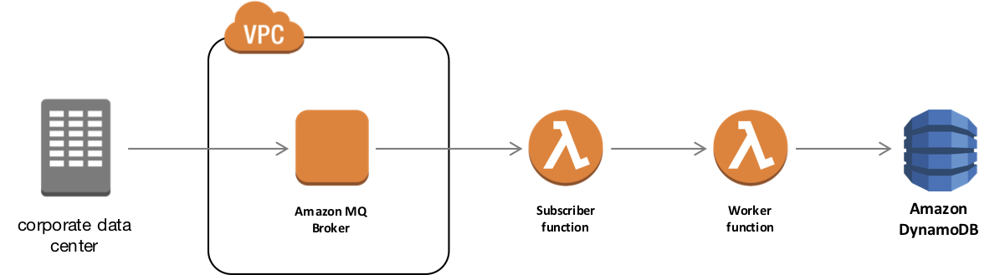

# amazonmq-invoke-aws-lambda

This project is an example of one approach to invoking AWS Lambda from Queues and Topics managed by Amazon MQ brokers. This and other similar patterns can be useful in integrating legacy systems that leverage common APIs such as JMS with serverless architectures.

Our solution makes use of AWS CloudWatch Events to trigger a Lambda function that polls for messages on a queue. Messages are then sent to a second Lambda function that writes the message to an Amazon DynamoDB table. Further details can be found in our accompanying [blog post](TBD).



## Getting Started

To get started, clone this repository. The repository contains a [CloudFormation](https://aws.amazon.com/cloudformation/) template and source code to deploy and run the sample.

### Prerequisites

To run the sample, you will need to:

1. Select an AWS Region into which you will deploy services. Be sure that all required services (Amazon MQ, AWS Lambda, and Amazon DynamoDB) are available in the Region you select.
2. Confirm your [installation of the latest AWS CLI](http://docs.aws.amazon.com/cli/latest/userguide/installing.html) (at least version 1.14.2).
3. Confirm the [AWS CLI is properly configured](http://docs.aws.amazon.com/cli/latest/userguide/cli-chap-getting-started.html#cli-quick-configuration) with credentials that have administrator access to your AWS account.
4. [Install Node.js and NPM](https://docs.npmjs.com/getting-started/installing-node).

## Deployment

We will deploy the solution in two parts, first a new Amazon MQ broker, then two sample Lambda functions and DynamoDB table.

### Part 1: Amazon MQ Broker

Launching an Amazon MQ broker is easy via the [Amazon MQ Console](https://console.aws.amazon.com/amazon-mq/home) or AWS CLI. For details, see [Creating and Configuring an Amazon MQ Broker](http://docs.aws.amazon.com/amazon-mq/latest/developer-guide/amazon-mq-creating-configuring-broker.html).

Once the broker is ready, you will need to capture its Security Group ID(s) (e.g. "sg-12345678"). This information is available from the Amazon MQ Console or the AWS CLI as follows:

```
$ aws mq describe-broker --broker-id <MY_BROKER_ID> \
            --query 'SecurityGroups'
```

### Part 2: Serverless

We will use the [AWS Serverless Application Model](https://github.com/awslabs/serverless-application-model) to manage deployment of our EC2 instance, Lambda function, and other AWS resources:

1. From the command line, create a new S3 Bucket from which to deploy our source code:

	```
	$ aws s3 mb s3://<MY_BUCKET_NAME>
	```

2. Install Lambda dependencies:

	```
	$ cd subscriber && npm install

	$ cd ../worker && npm install

	$ cd ..
	```

3. Using the Serverless Application Model, package the source code:

	```
	$ aws cloudformation package --template-file template.yaml \
                --s3-bucket <MY_BUCKET_NAME> \
                --output-template-file packaged.yaml
	```

4. A single-instance broker launched without any changes to the default network and security configuration will be associated with one Security Group. In addition to the Security Group ID, you will also need the username and password you provided when creating the broker to deploy our Lambda functions and other resources:

	```
	$ aws cloudformation deploy --template-file packaged.yaml \
	            --stack-name aws-amazonmq-sample \
	            --capabilities CAPABILITY_IAM \
	            --parameter-overrides AmazonMQHost=<BROKER_ENDPOINT> \
                                      AmazonMQLogin=<AMAZONMQ_USERNAME> \
                                      AmazonMQPassword=<AMAZONMQ_PASSWORD> \
                                      AmazonMQQueueName=SAMPLE_QUEUE \
                                      AmazonMQSecurityGroupId=<SECURITY_GROUP_ID>
	```

8. It will take a few minutes for CloudFormation to finish deploying. Once status is `CREATE_COMPLETE`, move on to testing the integration.


## Run!

Once the CloudFormation stack is complete, we can send a test message using the ActiveMQ console.


1. Open the ActiveMQ Management Console, available at https://<BROKER_ENDPOINT>:8162.

2. Click the link "Manage ActiveMQ broker" and enter the username and password from when you created the broker.

3. In the menu just beneath the ActiveMQ logo, click the link at the far right, "Send".

4. Modify two fields:

	* Destination: SAMPLE_QUEUE
	* Message body: Hello World, let's invoke Lambda!

5. Click the Send button. Explore other aspects of the ActiveMQ console, particularly the Subscribers section, you should see one subscriber, your Flume instance.

6. When ready, open the AWS Console and navigate to DynamoDB.

7. Select "Tables" in the menu at left and then pick the table created by CloudFormation (name listed in CloudFormation Outputs).

8. Select the "Items" tab and view items below. You should see an entry that contains the message from above.


## Cleaning Up

Finally, we can clean up the environment using CloudFormation:

```
$ aws cloudformation delete-stack --stack-name aws-amazonmq-sample
```

As your Amazon MQ broker is not managed by CloudFormation, you will need to delete via the Console or CLI, if desired.

## License Summary

This sample code is made available under a modified MIT license. See the LICENSE file.

## Authors

* **jkahn** - *initial work*
